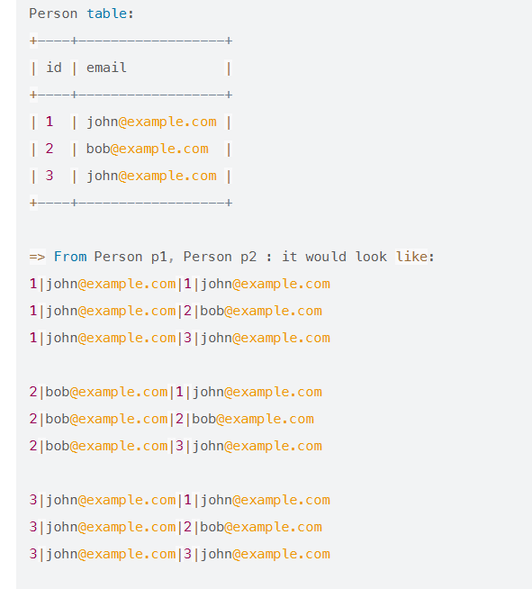
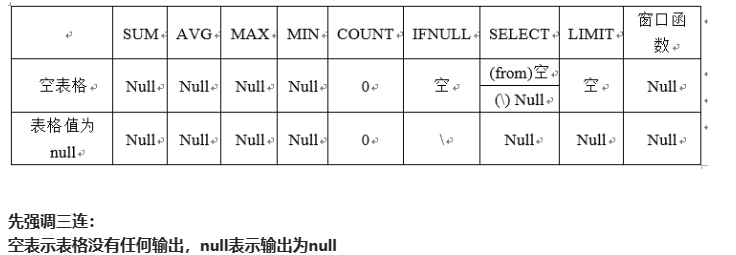

### [175. 组合两个表](https://leetcode.cn/problems/combine-two-tables/)

```sql
select P.firstName , P.lastName, A.city, A.state
from Person P left join Address A on P.PersonID = A.PersonID
```

> Note: 

left join ： 保留left table 全部数据

right join  ：保留right table 全部数据

inner join ：取两表公共数据


### [181. 超过经理收入的员工](https://leetcode.cn/problems/employees-earning-more-than-their-managers/)


``` sql
select e1.name Employee
from Employee e1 ,Employee e2 
where e1.ManagerId = e2.Id and e1.salary >  e2.salary
```


>Note:
>
>或者使用Join： 
>
>```sql
>SELECT
>     a.NAME AS Employee
>FROM Employee AS a JOIN Employee AS b
>     ON a.ManagerId = b.Id
>     AND a.Salary > b.Salary
>;
>```


### [182. 查找重复的电子邮箱](https://leetcode.cn/problems/duplicate-emails/)

```sql
select email as Email
from Person
group by Email 
having count(Email) >1
```


### [183. 从不订购的客户](https://leetcode.cn/problems/customers-who-never-order/)

```sql
select a.name as Customers
from Customers a left join Orders b on a.id = b.customerId 
where b.customerId is null 
```


### [511. 游戏玩法分析 I](https://leetcode.cn/problems/game-play-analysis-i/)

```sql
select player_id, min(event_date) first_login
from activity
group by player_id

```


### [586. 订单最多的客户](https://leetcode.cn/problems/customer-placing-the-largest-number-of-orders/)

```sql
select customer_number
from Orders 
group by customer_number
order by count(*) desc
limit 1
```


>note : 

desc 降序  asc 升序 


###  [607. 销售员](https://leetcode.cn/problems/sales-person/)

```sql
SELECT  s.name
FROM SalesPerson s
where s.sales_id not in
(SELECT o.sales_id
FROM Orders AS o join Company AS c on o.com_id = c.com_id
where c.name = 'RED')

```

> note:

子查询 

### [627. 变更性别](https://leetcode.cn/problems/swap-salary/)

```sql
# 1.
UPDATE Salary 
set 
sex = case sex when 'm' then 'f' else 'm' end 

# 2.
update salary set sex = if(sex='m','f','m');
```


>note:  动态设置 可以在使用CASE... WHEN... 的时候同时使用UPDATE语句
>
>case...when...


```sql
case 列名 
	when ..then ..
	when ..then ..
	else..
end 
```

UPDATE： 

```sql
update 表名
set 列名 = 修改后的值；
```


### [1050. 合作过至少三次的演员和导演](https://leetcode.cn/problems/actors-and-directors-who-cooperated-at-least-three-times/)

```sql
select actor_id, director_id 
from actordirector
group by actor_id, director_id
having count(*)>=3
```


### [196. 删除重复的电子邮箱](https://leetcode.cn/problems/delete-duplicate-emails/)

```sql
DELETE a
FROM Person a, Person b
WHERE a.id >b.id  and a.email = b.email
```

> note：自连接例子：
>
>  
>
> 
>
> 
>
> sql执行顺序 ： FROM > WHERE > GROUP BY > HAVING > SELECT >DISTINCT > ORDER BY > LIMIT/OFFSET 

### [197. 上升的温度](https://leetcode.cn/problems/rising-temperature/)

``` sql
select  a.id
from weather as a , weather as b 
where datediff(a.recordDate, b.recordDate) =1 
and a.Temperature > b.Temperature
```


> note:
>
> DATEDIFF(endDate, startDate) -- 返回两个日期之间的天数差异
>
> TIMEDIFF(time1, time2) -- 计算两个时间之间的差异
>
> DATE_ADD(date, INTERVAL expr type), DATE_SUB() -- 在日期上加上或减去一个指定的时间间隔


### [577. 员工奖金](https://leetcode.cn/problems/employee-bonus/)

```sql 
select e.name, b.bonus
from Employee as e left join  Bonus as b on e.empId = b.empId 
where b.bonus < 1000 or b.bonus is null
```


###  [584. 寻找用户推荐人](https://leetcode.cn/problems/find-customer-referee/)

```sql
select name 
from customer 
where referee_id !=2 or referee_id is null 
```


### [595. 大的国家](https://leetcode.cn/problems/big-countries/)

```sql
select name,population, area
from world
where area >= 3000000 or population >= 25000000
```


### [596. 超过5名学生的课](https://leetcode.cn/problems/classes-more-than-5-students/)

```sql
select class
from courses 
group by class 
having count(student) >=5
```


### [610. Triangle Judgement](https://leetcode.com/problems/triangle-judgement/)

```sql
SELECT x, y, z , if(x + y > z and x + z > y and y + z > x ,'Yes', 'No') as triangle 
FROM Triangle 
```


> note:
>
> Mysql中使用if ：
>
> ```sql
> IF(expression, value_if_true, value_if_false)
> ```


### [619. Biggest Single Number](https://leetcode.com/problems/biggest-single-number/)

```sql
select max(num) as num
from (select num
	  from MyNumbers 
      group by num 
      having count(*) =1 ) as new 

```

> note: 
>
> 


### [620. Not Boring Movies](https://leetcode.com/problems/not-boring-movies/)

```sql
select *
from Cinema 
where id%2 =1 and description != 'boring'
order by rating desc
```

> note:
>
> is not 和!=的区别 =》 !=用于两个非null值不相等时返回true , is not 通常用于特殊比较is not null ； is not true 
>
> 例如：
>
> ```sql
> select true is not true #会返回0
> select false is not true #会返回1 
> ```


### [1068. Product Sales Analysis I](https://leetcode.com/problems/product-sales-analysis-i/)


```sql
select p.product_name, s.year ,s.price 
from sales as s join product as p on s.product_id = p.product_id 
```


### [1075. Project Employees I](https://leetcode.com/problems/project-employees-i/)


```sql
select project_id , round(avg(experience_years),2) as average_years
from project as p join employee as e on p.employee_id = e.employee_id
group by project_id  

```

