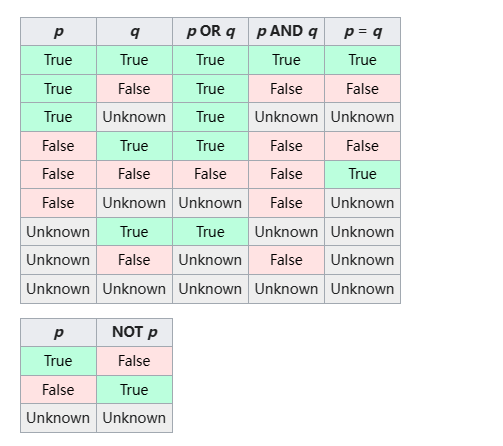

[TOC]


### [175. 组合两个表](https://leetcode.cn/problems/combine-two-tables/)

```sql
select P.firstName , P.lastName, A.city, A.state
from Person P left join Address A on P.PersonID = A.PersonID
```

> Note: 

left join ： 保留left table 全部数据

right join  ：保留right table 全部数据

inner join ：取两表公共数据


### [181. 超过经理收入的员工](https://leetcode.cn/problems/employees-earning-more-than-their-managers/)


``` sql
select e1.name Employee
from Employee e1 ,Employee e2 
where e1.ManagerId = e2.Id and e1.salary >  e2.salary
```


>Note:
>
>或者使用Join： 
>
>```sql
>SELECT
>     a.NAME AS Employee
>FROM Employee AS a JOIN Employee AS b
>     ON a.ManagerId = b.Id
>     AND a.Salary > b.Salary
>;
>```


### [182. 查找重复的电子邮箱](https://leetcode.cn/problems/duplicate-emails/)

```sql
select email as Email
from Person
group by Email 
having count(Email) >1
```


### [183. 从不订购的客户](https://leetcode.cn/problems/customers-who-never-order/)

```sql
select a.name as Customers
from Customers a left join Orders b on a.id = b.customerId 
where b.customerId is null 
```


### [511. 游戏玩法分析 I](https://leetcode.cn/problems/game-play-analysis-i/)

```sql
select player_id, min(event_date) first_login
from activity
group by player_id

```


### [586. 订单最多的客户](https://leetcode.cn/problems/customer-placing-the-largest-number-of-orders/)

```sql
select customer_number
from Orders 
group by customer_number
order by count(*) desc
limit 1
```


>note : 

desc 降序  asc 升序 


###  [607. 销售员](https://leetcode.cn/problems/sales-person/)

```sql
SELECT  s.name
FROM SalesPerson s
where s.sales_id not in
(SELECT o.sales_id
FROM Orders AS o join Company AS c on o.com_id = c.com_id
where c.name = 'RED')

```

> note:

子查询 

### [627. 变更性别](https://leetcode.cn/problems/swap-salary/)

```sql
# 1.
UPDATE Salary 
set 
sex = case sex when 'm' then 'f' else 'm' end 

# 2.
update salary set sex = if(sex='m','f','m');
```


>note:  动态设置 可以在使用CASE... WHEN... 的时候同时使用UPDATE语句
>
>case...when...


```sql
case 列名 
	when ..then ..
	when ..then ..
	else..
end 
```

UPDATE： 

```sql
update 表名
set 列名 = 修改后的值；
```


### [1050. 合作过至少三次的演员和导演](https://leetcode.cn/problems/actors-and-directors-who-cooperated-at-least-three-times/)

```sql
select actor_id, director_id 
from actordirector
group by actor_id, director_id
having count(*)>=3
```


### [196. 删除重复的电子邮箱](https://leetcode.cn/problems/delete-duplicate-emails/)

```sql
DELETE a
FROM Person a, Person b
WHERE a.id >b.id  and a.email = b.email
```

> note：自连接例子：
>
>  
>
> 
>
> 
>
> sql执行顺序 ： FROM > WHERE > GROUP BY > HAVING > SELECT >DISTINCT > ORDER BY > LIMIT/OFFSET 

### [197. 上升的温度](https://leetcode.cn/problems/rising-temperature/)

``` sql
select  a.id
from weather as a , weather as b 
where datediff(a.recordDate, b.recordDate) =1 
and a.Temperature > b.Temperature
```


> note:
>
> DATEDIFF(endDate, startDate) -- 返回两个日期之间的天数差异
>
> TIMEDIFF(time1, time2) -- 计算两个时间之间的差异
>
> DATE_ADD(date, INTERVAL expr type), DATE_SUB() -- 在日期上加上或减去一个指定的时间间隔


### [577. 员工奖金](https://leetcode.cn/problems/employee-bonus/)

```sql 
select e.name, b.bonus
from Employee as e left join  Bonus as b on e.empId = b.empId 
where b.bonus < 1000 or b.bonus is null
```


###  [584. 寻找用户推荐人](https://leetcode.cn/problems/find-customer-referee/)

```sql
select name 
from customer 
where referee_id !=2 or referee_id is null 
```


### [595. 大的国家](https://leetcode.cn/problems/big-countries/)

```sql
select name,population, area
from world
where area >= 3000000 or population >= 25000000
```


### [596. 超过5名学生的课](https://leetcode.cn/problems/classes-more-than-5-students/)

```sql
select class
from courses 
group by class 
having count(student) >=5
```


### [610. Triangle Judgement](https://leetcode.com/problems/triangle-judgement/)

```sql
SELECT x, y, z , if(x + y > z and x + z > y and y + z > x ,'Yes', 'No') as triangle 
FROM Triangle 
```


> note:
>
> Mysql中使用if ：
>
> ```sql
> IF(expression, value_if_true, value_if_false)
> ```


### [619. Biggest Single Number](https://leetcode.com/problems/biggest-single-number/)

```sql
select max(num) as num
from (select num
	  from MyNumbers 
      group by num 
      having count(*) =1 ) as new 

```

> note: 
>
> 


### [620. Not Boring Movies](https://leetcode.com/problems/not-boring-movies/)

```sql
select *
from Cinema 
where id%2 =1 and description != 'boring'
order by rating desc
```

> note:
>
> is not 和!=的区别 =》 !=用于两个非null值不相等时返回true , is not 通常用于特殊比较is not null ； is not true 
>
> 例如：
>
> ```sql
> select true is not true #会返回0
> select false is not true #会返回1 
> ```


### [1068. Product Sales Analysis I](https://leetcode.com/problems/product-sales-analysis-i/)


```sql
select p.product_name, s.year ,s.price 
from sales as s join product as p on s.product_id = p.product_id 
```


### [1075. Project Employees I](https://leetcode.com/problems/project-employees-i/)


```sql
select project_id , round(avg(experience_years),2) as average_years
from project as p join employee as e on p.employee_id = e.employee_id
group by project_id  

```


### [1084. Sales Analysis III](https://leetcode.com/problems/sales-analysis-iii/) 

```sql
select p.product_id, p.product_name 
from product as p join sales as s on p.product_id = s.product_id 
group by s.product_id
HAVING MIN(s.sale_date) >= "2019-01-01" AND MAX(s.sale_date) <= "2019-03-31"
```

> note:
>
> 在使用group by 分组之后，having子句通常与聚合函数一起使用（SUM, AVG, MIN, MAX ）


### [1141. User Activity for the Past 30 Days I](https://leetcode.com/problems/user-activity-for-the-past-30-days-i/)

```SQL
select activity_date as day, count(distinct user_id) as active_users 
from Activity
where activity_date between '2019-06-28' and '2019-07-27' 
group by day

```

>NOTE:
>
>在group by 之前可以先使用where条件进行筛选。


### [1148. Article Views I](https://leetcode.com/problems/article-views-i/)

```sql
select distinct author_id as id 
from views
where author_id = viewer_id
order by author_id asc
```

### [1179. Reformat Department Table](https://leetcode.com/problems/reformat-department-table/)

```sql
SELECT id,
SUM(CASE WHEN month = 'Jan' THEN revenue ELSE NULL END) AS Jan_Revenue,
SUM(CASE WHEN month = 'Feb' THEN revenue ELSE NULL END) AS Feb_Revenue,
SUM(CASE WHEN month = 'Mar' THEN revenue ELSE NULL END) AS Mar_Revenue,
SUM(CASE WHEN month = 'Apr' THEN revenue ELSE NULL END) AS Apr_Revenue,
SUM(CASE WHEN month = 'May' THEN revenue ELSE NULL END) AS May_Revenue,
SUM(CASE WHEN month = 'Jun' THEN revenue ELSE NULL END) AS Jun_Revenue,
SUM(CASE WHEN month = 'Jul' THEN revenue ELSE NULL END) AS Jul_Revenue,
SUM(CASE WHEN month = 'Aug' THEN revenue ELSE NULL END) AS Aug_Revenue,
SUM(CASE WHEN month = 'Sep' THEN revenue ELSE NULL END) AS Sep_Revenue,
SUM(CASE WHEN month = 'Oct' THEN revenue ELSE NULL END) AS Oct_Revenue,
SUM(CASE WHEN month = 'Nov' THEN revenue ELSE NULL END) AS Nov_Revenue,
SUM(CASE WHEN month = 'Dec' THEN revenue ELSE NULL END) AS Dec_Revenue
FROM Department 
GROUP BY id
ORDER BY id;
```

>note : 
>
>```sql
>CASE
>    WHEN condition1 THEN result1
>    WHEN condition2 THEN result2
>    ...
>    ELSE resultN -- 可选
>END
>
>```


### [1211. Queries Quality and Percentage](https://leetcode.com/problems/queries-quality-and-percentage/)

```sql
select query_name,round(sum(rating/position)/count(query_name),2) as quality ,round(sum(case when rating <3 then 1 else 0 end)/count(query_name)*100,2) as poor_query_percentage
from queries 
where query_name is not null
group by query_name
```


### [1251. Average Selling Price](https://leetcode.com/problems/average-selling-price/)

```sql
select  p.product_id,  COALESCE(round(sum(p.price*u.units)/sum(u.units),2),0) as average_price
from prices as p  left join unitssold u on p.product_id = u.product_id and u.purchase_date between p.start_date and p.end_date
group by p.product_id
```

> note:
>
> `COALESCE` 是一个 SQL 函数，用于从其参数列表中返回第一个非 `NULL` 值。如果所有给定的参数都是 `NULL`，则 `COALESCE` 函数也会返回 `NULL`。这个函数非常有用，特别是在处理可能包含 `NULL` 值的数据时，它可以帮助避免在应用逻辑上的错误或中断。


### [1280. Students and Examinations](https://leetcode.com/problems/students-and-examinations/)

```sql
select new.student_id, new.student_name, new.subject_name, count(e.subject_name) as attended_exams
from
(select * from students cross join subjects) as new  left join examinations as e on new.student_id = e.student_id and new.subject_name = e.subject_name
group by new.student_id, new.subject_name
order by new.student_id, new.subject_name
```

> note:
>
> 题目中需要找到每个学生参加每项考试的数量
>
> 所以首先将包含student_id, student_name  的Students表 和包含subject_name的Subjects表进行cross join 成为new表
>
> ```sql
> select * from students cross join subjects
> ```
>
> 得到每个学生都和不同的学科有交集
>
> 然后使用left join 和包含student_id subject_name 的表Examinations。
>
> left join的条件是student_id subject_name 相同。 这样方便之后对参与科目的数量进行统计
>
> ```sql
> (select * from students cross join subjects) as new  left join examinations as e on new.student_id = e.student_id and new.subject_name = e.subject_name
> ```
>
> 然后使用
>
> ```sql
> group by new.student_id, new.subject_name
> order by new.student_id, new.subject_name
> ```
>
> 因为以上的group by
>
> 最后统计参与的次数使用count(e.subject_name)
>
> ```sql
> select new.student_id, new.student_name, new.subject_name, count(e.subject_name) as attended_exams
> from
> (select * from students cross join subjects) as new  left join examinations as e on new.student_id = e.student_id and new.subject_name = e.subject_name
> group by new.student_id, new.subject_name
> order by new.student_id, new.subject_name
> 
> ```


### [1327. List the Products Ordered in a Period](https://leetcode.com/problems/list-the-products-ordered-in-a-period/)

```sql
select p.product_name,sum(o.unit) as unit
from products p join orders o on p.product_id = o.product_id 
where o.order_date between '2020-02-01' and '2020-02-29'
group by o.product_id
having sum(o.unit)>=100
```


### [1378. Replace Employee ID With The Unique Identifier](https://leetcode.com/problems/replace-employee-id-with-the-unique-identifier/)

```sql
select en.unique_id, e.name
from Employees e left join EmployeeUNI en on e.id = en.id 
```


### [1407. Top Travellers](https://leetcode.com/problems/top-travellers/)

```sql
select u.name, coalesce(sum(r.distance),0) as  travelled_distance 
from users u left join rides r on u.id = r.user_id 
group by u.id 
order by coalesce(sum(r.distance),0) desc, u.name asc 
```


### [1484. Group Sold Products By The Date](https://leetcode.com/problems/group-sold-products-by-the-date/)

```sql
select sell_date, count(distinct product) as num_sold, group_concat(distinct product order by product asc separator ',') as products
from activities 
group by sell_date 
order by sell_date asc
```

> note:
>
> concat(str1,str,....)函数：将多个字符串连接成一个字符串
>
> concat_ws(separator，str1,str2,..)函数：分隔符不能为null
>
> group_concat ([distinct] 要连接的字段[ order by 排序字段 asc/desc ] [separator ' 分隔符'])：将group by产生的同一个分组中的值连接起来，返回一个字符串结果。


### [1517. Find Users With Valid E-Mails](https://leetcode.com/problems/find-users-with-valid-e-mails/)

```sql
select *
from Users
where mail  REGEXP '^[A-Za-z][A-Za-z0-9_\.\-]*@leetcode(\\?com)?\\.com$' 
```

> note: 
>
> 正则表达式：
>
> 反斜杠 `\\` 用来转义
>
> ^ : 从字符串开始匹配的regexp模式
>
> [A-Za-z] ： 匹配大小写
>
> [A-Za-z0-9_\\.\\-]*  ：匹配第一字母后的任意字符（大小写，数字，下划线，句号，破折号）
>
> (\\\\ ?com)? 使?com 成为可选项 允许模式同时匹配 "@leetcode.com "和"@leetcode?com"
>
> $： regex模式结束


### [1527. Patients With a Condition](https://leetcode.com/problems/patients-with-a-condition/)

```sql
select *
from patients 
where conditions like '%_% DIAB1%' or conditions like 'DIAB1%'
```

> note:
>
> 通配符匹配： like '%_%' 
>
> - `%`：表示在字符串的开头或结尾可以包含任意数量的字符，或没有字符。
> - `_`：中间必须有一个字符。


### [1581. Customer Who Visited but Did Not Make Any Transactions](https://leetcode.com/problems/customer-who-visited-but-did-not-make-any-transactions/)

```sql
select Visits.customer_id, count(customer_id) as count_no_trans
from Visits  left join Transactions on Visits.visit_id=Transactions.visit_id
where transaction_id is null
group by customer_id
```


### [1587. Bank Account Summary II](https://leetcode.com/problems/bank-account-summary-ii/)


```SQL
select u.name as NAME, SUM(t.amount) as BALANCE
from Users u left join transactions t on u.account = t.account 
group by u.name
having sum(t.amount) > 10000
```


### [1633. Percentage of Users Attended a Contest](https://leetcode.com/problems/percentage-of-users-attended-a-contest/)

```sql
select r.contest_id, round((count(distinct r.user_id)*100)/(select count(user_id) from users),2) as  percentage
from register r  
group by r.contest_id
order by  percentage desc, contest_id asc 
```


### [1661. Average Time of Process per Machine](https://leetcode.com/problems/average-time-of-process-per-machine/)

```sql
select a1.machine_id, round(avg(a2.timestamp - a1.timestamp),3) as processing_time
from activity a1 join activity a2 
on a1.machine_id = a2.machine_id and a1.process_id = a2.process_id and a1.activity_type = 'start' and a2.activity_type = 'end'
group by a1.machine_id

```

>note:
>
>count()括号里不能直接使用条件，但可以使用case when .. then.. else.. end 


### [1667. Fix Names in a Table](https://leetcode.com/problems/fix-names-in-a-table/)

```sql
select user_id, concat(upper(left(name,1)),lcase(substring(name,2))) as name 
from users
order by user_id 
```

>note:
>
>upper()转换成大写 
>
>left（name，1）从左第一个
>
>lcase（）小写
>
>substring（name,2）从name第二个字符开始提取子字符串


### [1683. Invalid Tweets](https://leetcode.com/problems/invalid-tweets/)

```sql
select tweet_id
from tweets 
where length(content)>15
```


### [1693. Daily Leads and Partners](https://leetcode.com/problems/daily-leads-and-partners/)

```sql
select date_id, make_name,count(distinct lead_id)as unique_leads,count(distinct partner_id) unique_partners
from dailysales 
group by date_id,make_name
```


### [1729. Find Followers Count](https://leetcode.com/problems/find-followers-count/)

```sql
select user_id,count(follower_id) as followers_count
from followers
group by user_id
order by user_id asc
```


### [1731. The Number of Employees Which Report to Each Employee](https://leetcode.com/problems/the-number-of-employees-which-report-to-each-employee/)

```sql
select e1.employee_id, e1.name, count(e2.reports_to) as reports_count,round(avg(e2.age),0) as average_age
from employees e1 join employees e2 on e1.employee_id = e2.reports_to 
group by e2.reports_to
order by e1.employee_id
```


### [1741. Find Total Time Spent by Each Employee](https://leetcode.com/problems/find-total-time-spent-by-each-employee/)

```sql 
select event_day as day, emp_id, sum(out_time-in_time) as total_time 
from employees 
group by event_day, emp_id 
```


### [1757. Recyclable and Low Fat Products](https://leetcode.com/problems/recyclable-and-low-fat-products/)

```sql
select product_id
from Products
where low_fats = 'Y' and recyclable = 'Y'
```


### [1789. Primary Department for Each Employee](https://leetcode.com/problems/primary-department-for-each-employee/)

```sql
SELECT employee_id, department_id 
FROM Employee
WHERE primary_flag = 'Y'UNION
SELECT employee_id, department_id 
FROM Employee
GROUP BY employee_id
HAVING COUNT(department_id) = 1;
```

> note:
>
> `UNION` 是用于合并两个或多个 `SELECT` 语句的结果集的操作符。`UNION` 会去除重复的行，但如果需要保留重复的行，可以使用 `UNION ALL`。


### [1795. Rearrange Products Table](https://leetcode.com/problems/rearrange-products-table/)

```sql
select product_id , 'store1' as store, store1 as price 
from Products
where store1 is not null 
union
select product_id , 'store2' as store, store2 as price 
from Products
where store2 is not null 
union
select product_id , 'store3' as store, store3 as price 
from Products
where store3 is not null 
```


### [1873. Calculate Special Bonus](https://leetcode.com/problems/calculate-special-bonus/)

```sql
select employee_id,case when employee_id%2 = 1 and name not like 'M%' then salary else 0 end as bonus
from employees
order by employee_id
```


> note:
>
> 使用字符匹配的时候用Like 或者 not like


### [1890. The Latest Login in 2020](https://leetcode.com/problems/the-latest-login-in-2020/)

```sql
select user_id,max(time_stamp) as last_stamp
from logins 
where time_stamp like '2020-%'
group by user_id
```


### [1965. Employees With Missing Information](https://leetcode.com/problems/employees-with-missing-information/)

```sql
select distinct employee_id 
from(select employee_id 
from employees
union
select employee_id
from salaries) as new 
where employee_id not in 
(select e. employee_id
from employees e join salaries s on e.employee_id = s.employee_id )
order by employee_id asc
```


### [1978. Employees Whose Manager Left the Company](https://leetcode.com/problems/employees-whose-manager-left-the-company/)

```sql
select employee_id
from employees
where manager_id not in (select distinct employee_id
from employees ) and salary< 30000
order by employee_id asc
```


### [2356. Number of Unique Subjects Taught by Each Teacher](https://leetcode.com/problems/number-of-unique-subjects-taught-by-each-teacher/)

```sql
select teacher_id,count(distinct subject_id) cnt
from teacher 
group by teacher_id
```


***Medium***

### [176. Second Highest Salary](https://leetcode.com/problems/second-highest-salary/)

```sql
select max(salary) SecondHighestSalary
from employee
where salary !=
(select max(salary)
from employee )
```


### [177. Nth Highest Salary](https://leetcode.com/problems/nth-highest-salary/)

```sql
CREATE FUNCTION getNthHighestSalary(N INT) RETURNS INT
BEGIN
declare m int;
    set m = N-1;
    RETURN(
        select distinct salary 
        from employee
        order by salary desc
        limit m,1
    );
END
```


> note :
>
> 如何写函数体：
>
> ```sql
> CREATE FUNCTION function_name(parameter_name parameter_type) RETURNS return_type 
> BEGIN
> --函数体
>  	DECLARE variable_name variable_type;
>  	SET variable_name = value;
>  	RETURN (expression);
> END
> ```
>
> 解题思路：
>
> 如何找到第N高薪资？
>
> 查找第 n 高薪资的查询涉及按降序对不同的薪资进行排序，并将结果限制在第 n 行。这里我们从 N 减去 1，因为 SQL 索引从 0 开始。
>
> 注： limit 后只能跟具体数值，不能跟表达式，比如这道题limit后不能直接使用limit N-1，1


### [178. Rank Scores](https://leetcode.com/problems/rank-scores/)

```sql
SELECT
  S.score,
  DENSE_RANK() OVER (
    ORDER BY
      S.score DESC
  ) AS 'rank'
FROM
  Scores S;
```

窗口函数：

DENSE_RANK() - 分配连续的排名，对等项视为并列并获得相同的排名

```sql
<窗口函数> over (partition by <用于分组的列名> order by <排名>)
```


### [180. Consecutive Numbers](https://leetcode.com/problems/consecutive-numbers/)

```sql
select distinct(a) as ConsecutiveNums
from(
    select lead(Num,1)over(order by id) as a,
    Num as b,
    lag(Num,1)over(order by id ) as c,
    id AS current_id,
    LEAD(id, 1) OVER (ORDER BY id) AS next_id,
    LAG(id, 1) OVER (ORDER BY id) AS prev_id
    from logs 
)t
where t.a = t.b and t.a = t.c AND (t.current_id = t.prev_id + 1) AND (t.current_id = t.next_id - 1)
```


窗口函数：

- lead(列名，offset, 默认值)：向后偏移 offset 的列值；
- lag(列名，offset, 默认值) ：向前偏移 offset 的列值；


### [184. Department Highest Salary](https://leetcode.com/problems/department-highest-salary/)

```sql
select new.department,new.employee,new.salary
from(select d.name as department, e.name as employee, e.salary as salary, Max(e.salary) over (partition by d.id) as max_salary
from employee e join department d on e.departmentId = d.id
)as new
where new.salary = new.max_salary
```


### [550. Game Play Analysis IV](https://leetcode.com/problems/game-play-analysis-iv/)

```sql
select round(count(new.player_id)/(select count(distinct player_id) from activity),2) as fraction 
from(select  player_id,event_date,dense_rank () over (partition by player_id order by event_date asc) as first_log
from activity ) as new join activity as a on date_add(new.event_date, interval 1 day) = a.event_date
where new.first_log =1 and new.player_id = a.player_id
```

> note: count()聚合的函数只有一行


### [608. Tree Node](https://leetcode.com/problems/tree-node/)

```sql
select id,case when p_id is null then 'Root' when id not in (select p_id from tree where p_id is not null) then 'Leaf' else 'Inner' end  as type
from tree
```

我们也可以使用'in' 代替'not in'

```sql
select id,case when p_id is null then 'Root' when id in (select p_id from tree ) then 'Inner' else 'Leaf' end  as type
from tree
```

这里为什么使用not in的时候需要后面的值不为null 而使用in的时候后面可以为空呢？ 我们就需要介绍一下SQL的三值逻辑

在三值逻辑中 我们有true false 以及unknown

比如 3 not in (1,2,3,null)就可以化简成为

3!=1 and 3!=2 and 3!=3 and 3!=null (比较两个空值或将空值与其他任何值进行比较均返回 unknown)

继续=> (true and true and) false and null 

=>false


3 in(1,2,3,null) 

=> 3=1 or 3=2 or 3=3 or 3=null 

=>false or false or true or null

=> true



[Null (SQL) - Wikipedia](https://en.wikipedia.org/wiki/Null_(SQL))


### [626. Exchange Seats](https://leetcode.com/problems/exchange-seats/)

```sql
select case when id%2=0 then id-1 when id%2=1 and id = (select max(id) from seat )then id else id+1 end as id,student
from seat
order by id asc
```


聚合函数不能使用id=max(id) 而应该用子查询


### [1045. 买下所有产品的客户](https://leetcode.cn/problems/customers-who-bought-all-products/)

```sql
select distinct customer_id
from Customer 
where product_key in(select product_key from Product)
group by customer_id 
having count(distinct product_key)=(select count(*) from Product)
```

[MySQL外键约束（FOREIGN KEY）是什么？-CSDN博客](https://blog.csdn.net/qq_42534026/article/details/106158803)

本题中customer表（从表）的product_keys是表product表的foreign key

在product表（主表）中product_key是主键

外键性质：

从删主不删 主删从不见 无法在从表中插入主表中不存在的主键


### [570. Managers with at Least 5 Direct Reports](https://leetcode.com/problems/managers-with-at-least-5-direct-reports/)

```sql
select name
from employee
where id in(select managerId
from employee
group by managerId
having count(managerId)>=5)
```


### [585. Investments in 2016](https://leetcode.com/problems/investments-in-2016/)

```sql
select round(sum(tiv_2016),2) tiv_2016 from insurance 
where tiv_2015 in(
                    select tiv_2015 from insurance group by tiv_2015 having count(*)>1)
and concat(lat,lon) in(
                    select concat(lat,lon)
                    from insurance 
                    group by lat,lon
                    having count(*)=1 
                      )
```


### [602. Friend Requests II: Who Has the Most Friends](https://leetcode.com/problems/friend-requests-ii-who-has-the-most-friends/)

```sql
SELECT id, COUNT(*) as num
FROM (
    SELECT requester_id AS id FROM RequestAccepted
    UNION ALL
    SELECT accepter_id AS id FROM RequestAccepted
) AS combined
GROUP BY id
ORDER BY num DESC
LIMIT 1;
```


### [1070. Product Sales Analysis III](https://leetcode.com/problems/product-sales-analysis-iii/)

```sql
select  product_id,year as first_year,quantity,price
from (select product_id,dense_rank() over (partition by product_id order by year asc ) as a,quantity,year,price from sales) as new
where new.product_id in (select product_id from Product) and a=1

```

或者使用CTE

```sql
WITH CTE AS (
    SELECT product_id, MIN(year) AS minyear FROM Sales 
    GROUP BY product_id 
)

SELECT s.product_id, s.year AS first_year, s.quantity, s.price 
FROM Sales s
INNER JOIN CTE ON cte.product_id = s.product_id  AND s.year = cte.minyear; 
```


### [1158. Market Analysis I](https://leetcode.com/problems/market-analysis-i/)

```sql
with cte as (select * from Users as u left join (select * from orders where year(order_date)='2019' ) as o on u.user_id = o.buyer_id )
select cte.user_id as buyer_id, cte.join_date, count(cte.order_id) as orders_in_2019  from cte group by cte.user_id

```

count(null)结果恒为0

count(1)和count(*) 的值是非null的数量


### [1164. Product Price at a Given Date](https://leetcode.com/problems/product-price-at-a-given-date/)

```sql
select new.product_id,new.new_price  as price
from (select product_id, (dense_rank () over(partition by product_id order by change_date desc)) as rank1 ,new_price
from products
where change_date < '2019-08-17' ) as new
where rank1=1
union
select product_id, 10 as price
from products
group by product_id
having min(change_date) >'2019-08-16'
```


> 关键点：

*UNION*:  是用于合并两个或多个查询的结果集，并自动去除重复的行。

*UNION ALL*: 也用于合并查询结果，但不去除任何行，即保留所有的重复行。

*INTERSECT*: 返回同时存在于两个查询结果集中的行

*EXCEPT*: 返回存在于第一个查询结果集中但不存在于第二个查询结果集中的行


### [1174. Immediate Food Delivery II](https://leetcode.com/problems/immediate-food-delivery-ii/)


```sql
select round(count(*)*100/ (select count(distinct customer_id) from delivery ),2) as immediate_percentage
from (select dense_rank() over (partition by customer_id order by order_date asc) as rank1, customer_id,order_date,customer_pref_delivery_date 
from delivery) as new
where new.rank1 = 1 and new.order_date =new.customer_pref_delivery_date
```

注意distinct

### [1193. Monthly Transactions I](https://leetcode.com/problems/monthly-transactions-i/)

```sql
select trans_date as month, country, count(*) as trans_count, sum(state='approved') as approved_count, sum(amount) as trans_total_amount, sum(if(state='approved',amount,0)) as approved_total_amount 
from (select id,country,state,amount,SUBSTRING(trans_date,1,7) as trans_date
from transactions ) as a
group by a.trans_date, country
```

注意：

count(0)还是等于1，所以需要用count(if(...,1,null)) 


### [1204. Last Person to Fit in the Bus](https://leetcode.com/problems/last-person-to-fit-in-the-bus/)

```sql
select person_name
from
    (select
    person_name,
    sum(weight) over(order by turn) as Total_Weight
    from Queue)tmp
where Total_Weight<=1000
order by Total_Weight desc limit 1
```


窗口函数sum()可以实现累加求和


### [1321. Restaurant Growth](https://leetcode.com/problems/restaurant-growth/)

关键点：窗口函数，滑动窗口

参考链接：https://leetcode.cn/problems/restaurant-growth/solutions/1047332/jiang-jie-bing-gai-jin-ping-lun-qu-da-la-34xv

首先理解题意，计算七天窗口内消费者付的平均金额。

了解一下窗口函数，之前我们一直没有用到窗口滑动的数据范围。

```sql
[你要的操作] OVER ( PARTITION BY  <用于分组的列名>
                    ORDER BY <按序叠加的列名> 
                    ROWS <窗口滑动的数据范围> )
```

**<窗口滑动的数据范围> 用来限定[ 你要的操作] 所运用的数据的范围，具体有如下这些：**

```sql
当前行 - current row
之前的行 - preceding
之后的行 - following
无界限 - unbounded
表示从前面的起点 - unbounded preceding
表示到后面的终点 - unbounded following
```

举个例子：

```sql
取当前行和前五行：ROWS between 5 preceding and current row --共6行
取当前行和后五行：ROWS between current row and 5 following --共6行
取前五行和后五行：ROWS between 5 preceding and 5 folowing --共11行
```

本题中，要按照日期累计金额，从当天算起一共7天。

可以理解成操作是累计金额，按序叠加的列是日期，窗口内的函数要取当前行和前6行。

需要注意的是：

- 即使前边的数据不够，窗口函数也会将范围内的数据框住并计算，因此需要最后手动地只要能够完整框住7天的情况。
- 另外比较阴损的是，本题的数据中存在着某一日有多个消费的情况，这样一来即使窗口照旧向前取6天就无法覆盖被挤出去的数据了，因此，需要构建一个小表格用来存放每天的金额总量 【绊子2】


```sql
SELECT DISTINCT visited_on,
       sum_amount AS amount, 
       ROUND(sum_amount/7, 2) AS average_amount
-- 以上是破解【绊子1】并计算平均值，少用一次窗口函数提高运行速度
FROM (
    SELECT visited_on, 
       SUM(amount) OVER ( ORDER BY visited_on ROWS/RANGE 6 PRECEDING ) AS sum_amount
    -- 以下是计算每天的金额总量，破解【绊子2】
    FROM (
        SELECT visited_on, 
            SUM(amount) AS amount
        FROM Customer
        GROUP BY visited_on
         ) TT
     ) LL
-- 最后手动只要覆盖完整7天的数据，破解【绊子1】
WHERE DATEDIFF(visited_on, (SELECT MIN(visited_on) FROM Customer)) >= 6
```

- 首先计算每天的金额总量，存储在一个子查询表格中

- 利用滑动窗口，计算每七天的金额总量

- 最后利用where过滤能够覆盖完整7天的数据

  这里我们少使用了窗口函数来提高运行速度，可以直接除以7。


### [1341. Movie Rating](https://leetcode.com/problems/movie-rating/)


```sql
(select u.name  as results 
from Users as u join MovieRating as m on u.user_id = m.user_id
group by m.user_id
order by count(m.user_id) desc ,u.name
limit 1 )
union all
(select m1.title as results 
from MovieRating  m join movies m1 on m.movie_id = m1.movie_id
where substring(m.created_at,1,7)='2020-02'
group by m.movie_id  
order by sum(m.rating)/count(m.movie_id) desc ,m1.title asc 
limit 1 )
```

注意电影名和顾客重名 ，需要使用union all 包含重复的行

having后只能使用聚合函数 

sum(m.rating)/count(m.movie_id) 可以直接使用avg(m.rating)替换。

lexicographically 字典序